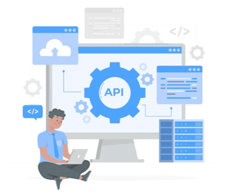

---
hide:
  - navigation
  - toc
---

<h1><strong> RMoney API Documentation</h1>

  

    

      
Welcome to

      <h1 class="hm-title"><strong>RMoney API</h1>
      
Build powerful trading and investment applications with real-time market data, order management, portfolio tracking and more.

      

        <a href="https://xts.rmoneyindia.co.in:3000/dashboard#!/login" class="hm-btn-orange">Get API Key</a>
        <a href="QS/guide/" class="hm-btn-outline">Quick Start </a>
         <a href="GS/intro/" class="hm-btn-outline">Introduction </a>
         <a href="Library/lib/" class="hm-btn-outline">Library Installation </a>
      

    

    

      
    

  

## API Categories

  <a href="interactive/overview/" class="hm-cat-card">
    <h3>Interactive API</h3>
    
Access real-time data and interactive charts.

    Explore &#8594;
  </a>
  <a href="market/overview/" class="hm-cat-card">
    <h3>Market Data API</h3>
    
Get quotes, instruments, market depth and more.

    Explore &#8594;
  </a>
  <a href="websocket/overview/" class="hm-cat-card">
    <h3>WebSocket</h3>
    
Subscribe to real-time market data streams.

    Explore &#8594;
  </a>
  <a href="references/overview/" class="hm-cat-card">
    <h3>References</h3>
    
Enums, constants and API reference data.

    Explore &#8594;
  </a>

## Platform Stats

  

    

      99.9%
      Uptime
      High availability
    

  

  

    

      50ms
      Low Latency
      Fast market data
    

  

  

    

      256-bit
      SSL Encryption
      Secure connections
    

  

  

    

      24/7
      Developer Support
      Always here to help
    

  

