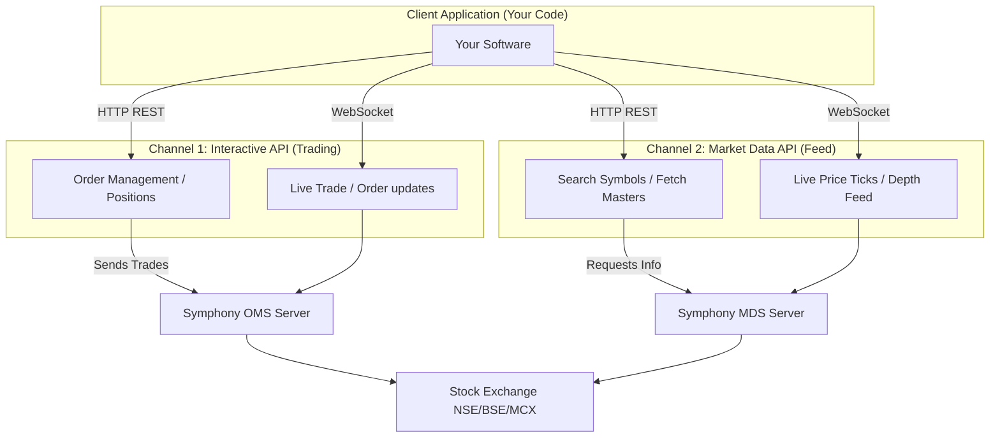
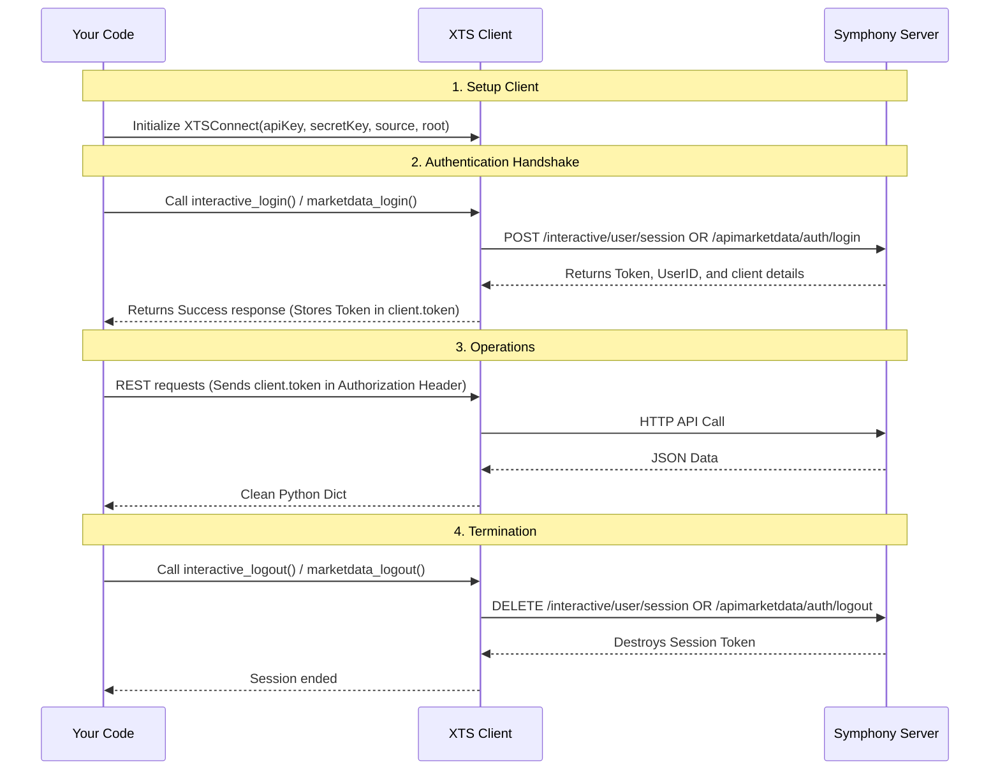
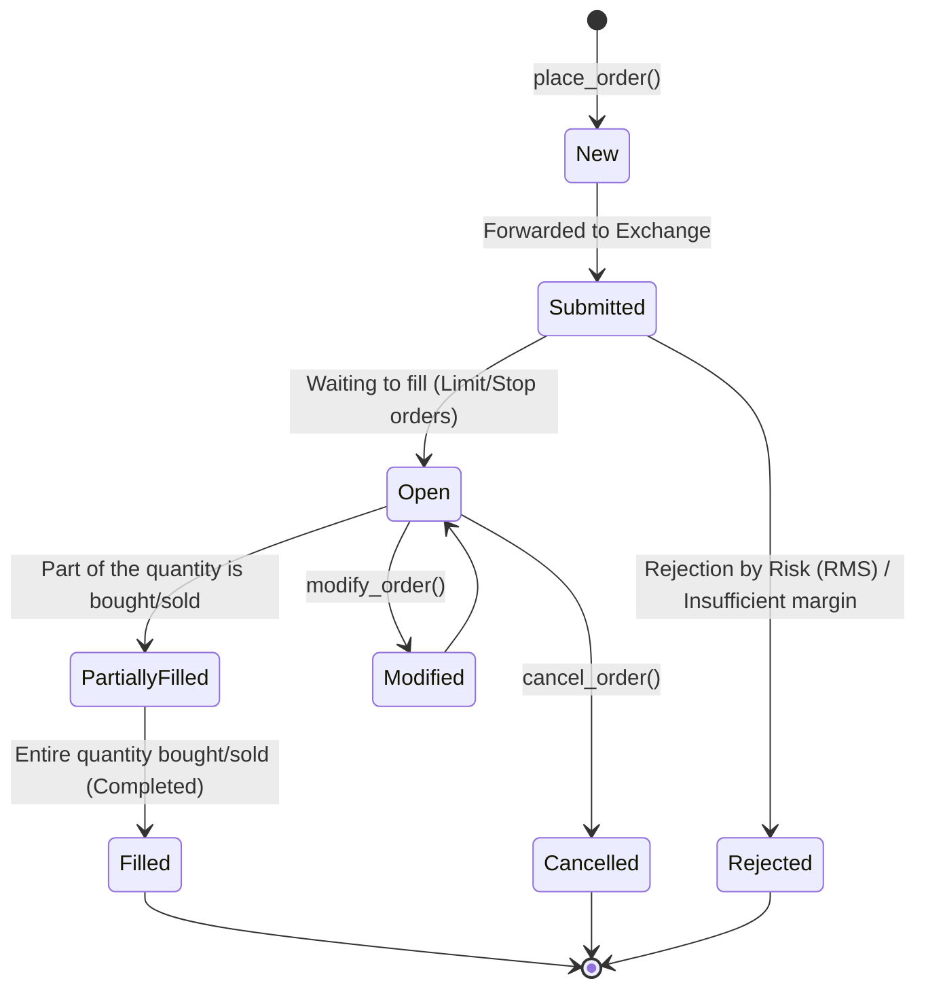
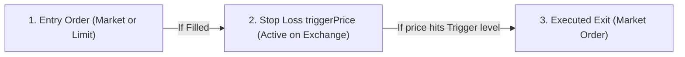
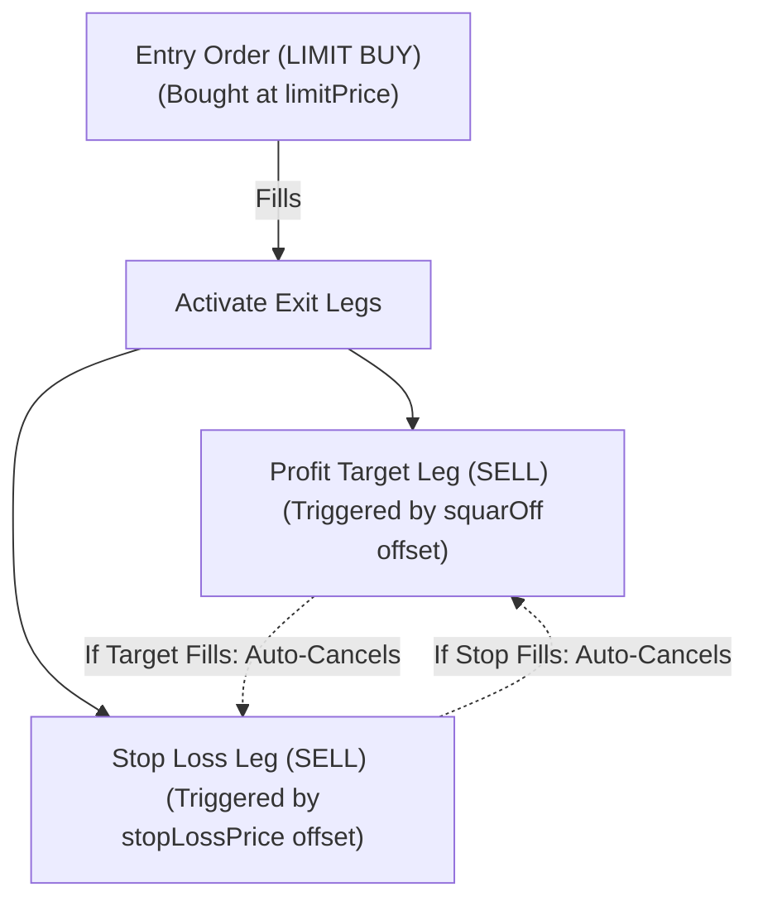
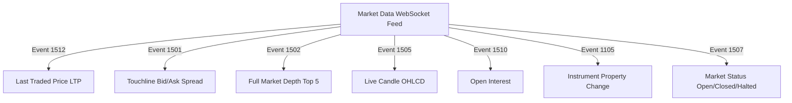

# 📘 The Complete Reference Manual: Symphony XTS API v2 & Python Client Library

Welcome! This is a comprehensive, standalone guide designed for new users and programmers to master the **Symphony XTS Front-End API (v2.0)** and its official Python client library, `xts-api-client`. 

No prior experience with trading APIs is required. We explain everything from high-level architecture to low-level parameters, supplemented by visual diagrams and code examples.

---

## 1. High-Level Concepts & Mental Models

### What is XTS?
Symphony XTS is a high-speed trading system interface. It sits between your custom software (trading bot, dashboard, or scanner) and the stock brokers/exchanges (like NSE, BSE, MCX).

### The Two-Channel Split (Dual Engine)
To prevent network traffic jams, XTS separates commands into two entirely independent channels:



* **Interactive API**: Private and secure. Used to place trades, check cash balances, query open positions, and get instant notifications when your orders fill.
* **Market Data API**: Public and read-only. Used to fetch stock names, request historical candle data, and stream real-time price updates (LTP, bid/ask spreads).

---

## 2. Technical Vocabulary & Business Rules

Before writing code, you must understand the terminology used in API parameters:

### A. Exchange Segments
Tells XTS which market segment you are querying:
* `NSECM` (1): National Stock Exchange Cash Market (Buying actual shares of Reliance, TCS, etc.)
* `NSEFO` (2): National Stock Exchange Futures & Options (Trading Nifty options/futures)
* `NSECD` (3): National Stock Exchange Currency Derivatives (USD/INR trading)
* `MCXFO` (51): Multi Commodity Exchange Futures & Options (Gold, Silver, Crude Oil)
* `BSECM` (11) & `BSEFO` (12): Bombay Stock Exchange equivalents

### B. Product Types
Tells the broker how to manage the trade margin and holding period:
* `MIS` (Margin Intraday Square-off): Closed automatically before market shuts. Offers high leverage.
* `NRML` (Normal): Used to hold futures & options contracts for multiple days.
* `CNC` (Cash and Carry): Used to buy actual stock shares for long-term investing. No leverage.

### C. Order Types
* `MARKET`: Buys/sells immediately at the best available current market price.
* `LIMIT`: Executes only at your specified price or better.
* `STOPMARKET`: Triggered when the market price hits a target trigger price, then executes as a Market order.
* `STOPLIMIT`: Triggered when the market price hits a target trigger price, then places a Limit order.

### D. Time In Force (Validity)
* `DAY`: The order is valid until the market closes today.
* `IOC` (Immediate or Cancel): The order must execute instantly, or any unfilled part is cancelled.
* `FOK` (Fill or Kill): The entire order must execute instantly in full, or the whole order is cancelled.

---

## 3. Library Architecture & File Structure

Here is a map of the `xts-api-client` package, detailing what each file does:

```text
xts_api_client/
│
├── __init__.py                  # Exposes the library classes and initialization constants.
│
├── xts_connect_async.py         # Main Async REST client. Exposes 'XTSConnect' for HTTP endpoints using asyncio.
├── xts_connect.py               # Main Sync REST client. Exposes synchronous 'XTSConnect' for non-async scripts.
│
├── interactive_socket.py        # Connects to the Interactive WebSocket stream (Socket.IO client for orders).
├── interactive_socket_client.py # Protocol (Interface) defining callback hooks for order changes.
│
├── market_data_socket.py        # Connects to the Market Data WebSocket stream (Socket.IO client for prices).
├── market_data_socket_client.py # Protocol (Interface) defining callback hooks for price events.
│
├── xts_exception.py             # Custom exceptions: XTSTokenException, XTSOrderException, XTSNetworkException.
│
└── helper/
    ├── helper.py                # Formatting and processing utilities (e.g. Master lists parsing, time converters).
    └── helper_classes.py        # Dataclass wrappers representing Cash, Future, and Option details.
```

---

## 4. REST API Reference: Authentication & Session

Every action requires a session token. Here is the lifecycle of an XTS session:



### Authentication Endpoints
* **Interactive Login**: `POST /interactive/user/session`
* **Interactive Logout**: `DELETE /interactive/user/session`
* **Market Data Login**: `POST /apimarketdata/auth/login`
* **Market Data Logout**: `DELETE /apimarketdata/auth/logout`

### Python Authentication Code Example
```python
import asyncio
from xts_api_client.xts_connect_async import XTSConnect

async def manage_session():
    # 1. Initialize the clients
    interactive_client = XTSConnect(
        apiKey="your_interactive_key",
        secretKey="your_interactive_secret",
        source="WEBAPI",
        root="https://api.yourbroker.com"
    )
    
    # 2. Login (This fetches and automatically saves the token to client.token)
    login_resp = await interactive_client.interactive_login()
    print("Interactive Logged In! Token:", interactive_client.token)
    print("User ID:", interactive_client.userID)
    
    # 3. Log out to clean up session
    logout_resp = await interactive_client.interactive_logout()
    print("Logged out successfully!")

asyncio.run(manage_session())
```

---

## 5. Interactive API (Trading Operations)

The Interactive client manages your money, orders, and positions.

### A. Order Placement & The Order Lifecycle
When you submit an order, it moves through a state machine inside the exchange:



### B. Order Parameters Deep Dive

When calling `place_order()`, you must specify the following parameters:

```python
response = await client.place_order(
    exchangeSegment="NSECM",             # "NSECM", "NSEFO", "MCXFO"
    exchangeInstrumentID=2885,           # Numeric code for the stock (e.g. 2885 for RELIANCE)
    productType="MIS",                   # "MIS" (Intraday), "NRML" (F&O Carryover), "CNC" (Equity Delivery)
    orderType="LIMIT",                   # "MARKET", "LIMIT", "STOPMARKET", "STOPLIMIT"
    orderSide="BUY",                     # "BUY" or "SELL"
    timeInForce="DAY",                   # "DAY", "IOC"
    disclosedQuantity=0,                 # Quantity visible to public order book (0 hides nothing)
    orderQuantity=10,                    # Total quantity to buy/sell
    limitPrice=2450.50,                  # Price to execute (required if LIMIT or STOPLIMIT)
    stopPrice=0.0,                       # Trigger price (required if STOPMARKET or STOPLIMIT)
    orderUniqueIdentifier="my_bot_01"    # Custom string tag to track this specific order
)
```

---

### C. Advanced Order Types (Cover & Bracket)

#### 1. Cover Orders (CO)
A Cover Order has a **stop-loss order chained directly to it**. It is highly leveraged and requires an entry transaction and a trigger price (the stop-loss activation level).



**Cover Order Parameters & Code:**
```python
# Place a Cover Order: Buy Reliance at market, stop-loss trigger active at ₹2400
co_response = await client.place_cover_order(
    exchangeSegment="NSECM",
    exchangeInstrumentID=2885,
    orderSide="BUY",
    orderType="MARKET",
    orderQuantity=5,
    disclosedQuantity=0,
    limitPrice=0.0,              # 0.0 because orderType is MARKET
    stopPrice=2400.0,            # Stop Loss Trigger level
    orderUniqueIdentifier="co_trade_01"
)
```

#### 2. Bracket Orders (BO)
A Bracket Order surrounds your entry order with two bracket legs: a **Take Profit Target** and a **Stop-Loss Protection**. Both exit orders are sent to the exchange as a **One-Cancels-the-Other (OCO)** pair.



**Bracket Order Parameters & Code:**
```python
# Place a Bracket Order: Buy Reliance at ₹2450. Sell at ₹2500 for profit (+50) or ₹2420 for loss (-30)
bo_response = await client.place_bracketorder(
    exchangeSegment="NSECM",
    exchangeInstrumentID=2885,
    orderType="LIMIT",
    orderSide="BUY",
    disclosedQuantity=0,
    orderQuantity=10,
    limitPrice=2450.00,
    squarOff=50.0,              # Profit target offset (added to entry price)
    stopLossPrice=30.0,         # Stop-Loss protection offset (subtracted from entry price)
    trailingStoploss=0.0,       # 0.0 means inactive. Set value to adjust SL up as price rises
    isProOrder=False,           # Set True for proprietary trading accounts
    orderUniqueIdentifier="bo_trade_01"
)
```

---

### D. Spread & GTT Orders

#### 1. Spread Orders
Spread orders let you trade price differences between two stock options or futures contracts simultaneously (e.g. buying July Futures and selling August Futures).

* **Place Spread**: `POST /interactive/orders/spread`
* **Modify Spread**: `PUT /interactive/orders/spread`
* **Cancel Spread**: `DELETE /interactive/orders/spread`

#### 2. GTT (Good-Till-Triggered) Orders
GTT orders remain active in the system for **weeks or months** until a target trigger price is hit. Once hit, it launches a standard order.

* **Place GTT**: `POST /interactive/orders/gtt`
* **GTT Order Book**: `GET /interactive/orders/gtt/orderbook`
* **Cancel GTT**: `DELETE /interactive/orders/gtt`

---

### E. Portfolio Management & Positions

Once you have active trades, you query your balances and positions:

```python
async def query_portfolio(client):
    # 1. Available margin and cash balance
    balance = await client.get_balance()
    available_cash = balance['result']['BalanceList'][0]['limitObject']['RMSSubLimits']['cashAvailable']
    print(f"Available Cash: ₹{available_cash}")

    # 2. Holdings (Long-term stocks held in your demat account)
    holdings = await client.get_holding()
    print("Holdings List:", holdings['result'])

    # 3. Daywise positions (Today's trading activity)
    day_pos = await client.get_position_daywise()
    
    # 4. Netwise positions (Current active net open positions)
    net_pos = await client.get_position_netwise()
    for pos in net_pos['result']:
        print(f"Instrument: {pos['ExchangeInstrumentID']} | Open Qty: {pos['NetQty']} | MTM PnL: ₹{pos['MTM']}")

    # 5. Convert Position (e.g., convert Intraday 'MIS' to Delivery 'CNC')
    await client.convert_position(
        exchangeSegment="NSECM",
        exchangeInstrumentID=2885,
        targetQty=5,
        isDayWise=True,
        oldProductType="MIS",
        newProductType="CNC"
    )
```

---

### F. Margin Calculator APIs
You can request how much cash margin is required to place or modify orders *before* actually sending them:

* **Regular Margin**: `POST /interactive/margin/regular`
* **Cover Margin**: `POST /interactive/margin/cover`
* **Bracket Margin**: `POST /interactive/margin/bracket`

---

## 6. Market Data API (Feeds & Queries)

The Market Data client fetches historical chart candles, instrument identifiers, and subscriptions.

```python
async def query_market_data(market_client):
    # 1. Search for a security by trading symbol
    search_resp = await market_client.search_by_scriptname("TATAMOTORS")
    instrument_id = search_resp['result'][0]['ExchangeInstrumentID']
    print(f"TATA Motors Instrument ID: {instrument_id}")

    # 2. Query Expiry Dates for Options/Futures contracts
    expiries = await market_client.get_expiry_date(
        exchangeSegment=2,          # NSEFO
        series="OPTIDX",            # Index Option
        symbol="NIFTY"
    )
    print("Nifty Option Expiries:", expiries['result'])

    # 3. Retrieve Historical Chart Candles (OHLC)
    candles = await market_client.get_ohlc(
        exchangeSegment=1,                # NSECM
        exchangeInstrumentID=22,           # NIFTY Index
        startTime="Jun 01 2026 091500",   # MMM DD YYYY HHMMSS
        endTime="Jun 15 2026 153000",
        compressionValue=5                 # 5-minute intervals
    )
    print("Raw Candle Data:", candles['result']['dataReponse'][:200])
```

---

## 7. Real-time Socket Streaming (WebSockets via Socket.IO)

WebSockets establish a constant, open channel of communication. Data flows automatically without your software having to ask for it.

### Step 1: Connection URL Breakdown
The library connects to the socket using a specific query string:
* **Interactive Socket**: `{root_url}/?token={token}&userID={userID}&apiType=INTERACTIVE`
* **Market Data Socket**: `{root_url}/?token={token}&userID={userID}&publishFormat=JSON&broadcastMode=Full`

---

### Step 2: The Event Code Map
The Market Data socket streams message packets prefixed with numeric **event codes**:



---

### Step 3: Complete WebSocket Listener Implementation
To catch these events, you subclass `MarketDataSocketClient` (for prices) or `InteractiveSocketClient` (for trading updates) and assign it to the socket managers:

```python
import asyncio
from xts_api_client.xts_connect_async import XTSConnect
from xts_api_client.market_data_socket import MDSocket_io
from xts_api_client.market_data_socket_client import MarketDataSocketClient

# 1. Create your listener implementation
class RealTimePriceFeed(MarketDataSocketClient):
    async def on_connect(self):
        print("🚀 Connected to live price feeds!")

    async def on_disconnect(self):
        print("🔌 Socket disconnected!")

    async def on_error(self, data):
        print("❌ Error from Socket:", data)

    # Event 1512: LTP Ticks
    async def on_event_last_traded_price_full(self, data):
        print(f"Price Tick -> ID: {data['ExchangeInstrumentID']} | Price: ₹{data['LastTradedPrice']}")

    # Event 1501: Bid/Ask Depth Ticks
    async def on_event_touchline_full(self, data):
        print(f"Spread -> Bid: {data['BidInfo']['Price']} | Ask: {data['AskInfo']['Price']}")

# 2. Main initialization script
async def stream_prices():
    # Login HTTP first
    client = XTSConnect(
        apiKey="your_market_key",
        secretKey="your_market_secret",
        source="WEBAPI",
        root="https://api.yourbroker.com"
    )
    await client.marketdata_login()

    # Assign socket listener
    listener = RealTimePriceFeed()
    socket_client = MDSocket_io(
        token=client.token,
        userID=client.userID,
        root_url=client.root,
        marketdatasocketclient=listener
    )
    
    # Establish connection
    await socket_client.connect()
    
    # Subscribe to Reliance (2885) and Nifty (22)
    instruments = [
        {"exchangeSegment": 1, "exchangeInstrumentID": 2885},
        {"exchangeSegment": 1, "exchangeInstrumentID": 22}
    ]
    await client.send_subscription(Instruments=instruments, xtsMessageCode=1512)
    
    # Keep the program running to see ticks stream
    await asyncio.sleep(20)
    
    # Clean up
    await socket_client.disconnect()
    await client.marketdata_logout()

if __name__ == "__main__":
    asyncio.run(stream_prices())
```

---

## 8. Mark-To-Market (MTM) PnL Calculations

Symphony calculates your unrealized profit or loss (PnL) in real-time. Here is how the math works:

$$\text{Total PnL} = \text{Realized PnL} + \text{Unrealized PnL}$$

### Realized PnL
Realized PnL is locked in when you complete a trade loop (Buy and Sell the same contract).
$$\text{Realized PnL} = (\text{Sell Price} - \text{Buy Price}) \times \text{Traded Quantity}$$

### Unrealized PnL
Unrealized PnL fluctuates as the market price moves. It is calculated on open positions:
* **For Long Positions (Open Quantity > 0):**
  $$\text{Unrealized PnL} = (\text{Current LTP} - \text{Average Buy Price}) \times \text{Open Quantity}$$
* **For Short Positions (Open Quantity < 0):**
  $$\text{Unrealized PnL} = (\text{Average Sell Price} - \text{Current LTP}) \times \text{Open Quantity (Absolute)}$$

---

## 9. Helper Library Utilities

The client library includes `xts_api_client.helper.helper` to parse and manage incoming data structures automatically.

### 1. Master List Parser (Pandas DataFrame)
Symphony sends large stock master files as pipeline-separated string streams. The helper converts them to clean Pandas dataframes:

```python
from xts_api_client.helper.helper import cm_master_string_to_df, fo_master_string_to_df

# Assume 'raw_csv_response' is retrieved from get_master() call
df_equities = cm_master_string_to_df(raw_csv_response)
# You can now run pandas queries
print(df_equities[df_equities['Name'] == 'RELIANCE'])
```

### 2. MS-DOS Time Zone Converter
Exchange times are given as seconds elapsed since the MS-DOS Epoch (1980-01-01). The helper translates this to standard Unix nanoseconds:

```python
from xts_api_client.helper.helper import dostime_secomds_to_unixtime

unix_nanoseconds = dostime_secomds_to_unixtime(1464972900)
print("Standard Unix timestamp:", unix_nanoseconds)
```

### 3. Account-Wide Squareoff Helper
The helper provides a routine to retrieve all your open positions and instantly exit them at market price to protect capital in emergencies:

```python
from xts_api_client.helper.helper import async_squareoff_all_positions_

# Retrieve all positions and close them out
sq_off_ids = await async_squareoff_all_positions_(interactive_client)
print("Emergency Squared off Order IDs:", sq_off_ids)
```

---

## 10. Robust Code Design: Reconnections & Retries

To deploy algorithms safely, you must handle network disconnects or API timeouts. Here is a production-grade template for a **`Gateway`** wrapper that you can copy to build your systems:

```python
import asyncio
import logging
from xts_api_client.xts_connect_async import XTSConnect
from xts_api_client.interactive_socket import OrderSocket_io
from xts_api_client.interactive_socket_client import InteractiveSocketClient
from httpx import PoolTimeout, ConnectTimeout, ReadTimeout

class OrderCallbackHandler(InteractiveSocketClient):
    def __init__(self, gateway):
        self.gateway = gateway
        
    async def on_connect(self):
        self.gateway.connected = True
        logging.info("WebSocket connected!")
        
    async def on_disconnect(self):
        self.gateway.connected = False
        logging.warning("WebSocket lost! Reconnecting...")
        asyncio.create_task(self.gateway.reconnect())

class XTSGateway:
    def __init__(self, api_url, key, secret):
        self.api_url = api_url
        self.key = key
        self.secret = secret
        self.client = None
        self.socket = None
        self.connected = False
        
    async def connect(self):
        # 1. Login REST API
        self.client = XTSConnect(self.key, self.secret, "WEBAPI", self.api_url)
        await self.client.interactive_login()
        
        # 2. Start WebSocket Connection
        self.socket = OrderSocket_io(
            token=self.client.token,
            userID=self.client.userID,
            root_url=self.client.root,
            reconnection=True,
            interativeSocketClient=OrderCallbackHandler(self)
        )
        await self.socket.connect()

    async def place_order_safe(self, params: dict, retries=4):
        """Places orders with auto-retry on HTTP timeouts"""
        for attempt in range(retries):
            try:
                response = await self.client.place_order(**params)
                return response
            except (PoolTimeout, ConnectTimeout, ReadTimeout) as timeout_exc:
                logging.warning(f"Timeout on attempt {attempt+1}/{retries}. Retrying...")
                await asyncio.sleep(0.5)
        raise RuntimeError("Failed to place order: Connection Timed Out")
```
